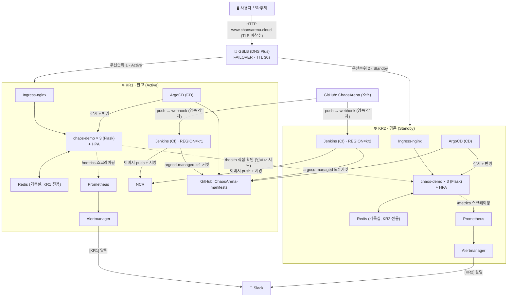

# ⚡ ChaosArena

**Kubernetes의 자가치유(Self-Healing)를 게임으로 체험하는 멀티 리전 대시보드.**
화면에서 버튼으로 장애를 일으키면, 실제로 떠있는 쿠버네티스 클러스터가 스스로 복구하는 과정을
실시간으로 지켜볼 수 있다. 그 위에 실무형 CI/CD, GitOps, 모니터링/알림, 리전 단위 재해복구까지
전부 직접 구축한 개인 인프라 프로젝트.

## 이 프로젝트가 보여주는 것

쿠버네티스는 "스스로 복구하는 시스템"이라고 말하지만, 그 말을 눈으로 본 사람은 드물다.
ChaosArena는 세 단계의 자가치유를 실제로 일으키고, 실제로 지켜볼 수 있게 만든다.

1. **파드 레벨** — 게임 화면에서 파드를 강제로 삭제해도 몇 초 안에 새 파드가 자동으로 뜬다
2. **오토스케일링 레벨** — CPU 부하를 주면 HPA가 파드 수를 자동으로 늘리고, 부하가 빠지면 줄인다
3. **리전 레벨** — 리전(KR1) 전체가 죽어도 GSLB가 자동으로 다른 리전(KR2)으로 트래픽을 돌린다 (실측 전환 약 67~80초, `/infra` 탭에서 실시간 관찰 가능)

그 위에 실제 운영 환경처럼 이미지 서명(공급망 보안), GitOps 기반 자동 롤백, Redis 기반 영속
저장소, Prometheus/Slack 알림, 그리고 **양쪽 리전에 완전히 대칭으로 복제된 컨트롤 플레인**
(Jenkins/ArgoCD/모니터링)까지 갖췄다 — 한쪽 리전이 통째로 죽어도 반대쪽이 독립적으로 빌드·배포를
계속할 수 있다.

## 아키텍처



Jenkins/ArgoCD/Prometheus가 양쪽 리전에 각각 존재하는 이유는 **컨트롤 플레인 이중화** —
한쪽 리전의 컨트롤 플레인이 오래 죽어있으면 반대쪽 서비스가 멀쩡해도 새 코드를 배포할 방법이
없어지는 단일장애점(SPOF)을 없애기 위함이다. 전체 요청 흐름을 시나리오별로 자세히 보고 싶다면
[`docs/ARCHITECTURE.md`](docs/ARCHITECTURE.md) 참고.

## 기술 스택

| 영역 | 사용 기술 |
|---|---|
| 클라우드 | NHN Cloud, 2개 리전(KR1 판교 / KR2 평촌) |
| IaC | Terraform |
| 오케스트레이션 | Kubernetes (kubeadm으로 직접 구축, 매니지드 아님) |
| 애플리케이션 | Python + Flask |
| 데이터 저장 | Redis (리전별 독립 인스턴스) |
| CI | Jenkins + Kaniko(데몬리스 빌드) + cosign(이미지 서명) |
| CD | ArgoCD (GitOps, Pull 모델) |
| 컨테이너 레지스트리 | NCR (서명 안 된 이미지 pull 차단 정책) |
| 모니터링/알림 | Prometheus + Alertmanager + Slack |
| 네트워크 | Ingress-nginx, GSLB(DNS Plus) 리전 간 자동 전환 |
| 오토스케일링 | HPA (CPU 기준) |

## 리포지토리 구조

```
.
├── app.py                # Flask 앱 — 게임 로직 + 대시보드 API
├── Dockerfile
├── Jenkinsfile            # CI 5-stage 파이프라인
├── requirements.txt
├── templates/             # 대시보드 화면 (게임 콘솔 / 실시간 대시보드 / 기록실 / CI-CD 미션 / 인프라 지도)
├── k8s/                   # 쿠버네티스 매니페스트 (Deployment/RBAC/Redis/HPA/Ingress 등)
├── terraform/             # 인프라 코드 (멀티 리전 클러스터 서버)
├── scripts/               # 클러스터 부트스트랩 스크립트 (kubeadm/Calico/GSLB 테스트 등)
└── docs/
    ├── ARCHITECTURE.md     # 시나리오별 전체 흐름 (초보자 관점)
    ├── CONCEPTS.md         # 기능별 설계 이유
    ├── PROJECT_LOG.md      # 시간순 트러블슈팅/의사결정 기록
    └── SETUP_GUIDE.md      # 처음부터 따라 만드는 실행 가이드
```

실제 배포 대상 매니페스트는 GitOps 원칙에 따라 별도 레포(`ChaosArena-manifests`)에서 ArgoCD가
지켜보고 있고, 이 레포의 `k8s/`는 소스/템플릿 역할을 한다.

## 로컬에서 실행해보기

클러스터 없이도 게임 UI/로직만 확인할 수 있는 로컬 모드가 있다:

```bash
pip install -r requirements.txt
LOCAL_MODE=true python app.py
```

`http://localhost:5000`에서 실행 확인. 파드/HPA/Prometheus 관련 값은 목업 데이터로 대체된다.

## 더 알아보기

- [`docs/ARCHITECTURE.md`](docs/ARCHITECTURE.md) — 실제 상황 하나가 벌어지면 어떤 컴포넌트를 거쳐가는지
- [`docs/CONCEPTS.md`](docs/CONCEPTS.md) — 각 기능을 왜 이렇게 설계했는지
- [`docs/PROJECT_LOG.md`](docs/PROJECT_LOG.md) — 겪은 장애물과 해결 과정 (시간순)
- [`docs/SETUP_GUIDE.md`](docs/SETUP_GUIDE.md) — 처음부터 직접 따라 만드는 가이드
