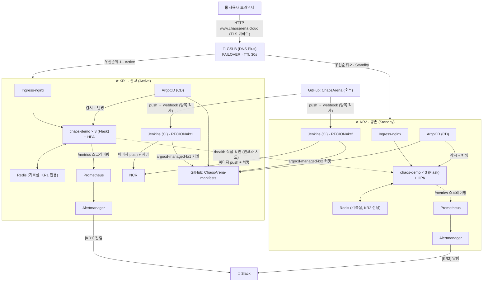

# ChaosArena 전체 흐름 — 초보자 관점 가이드

이 문서는 다른 3개 문서와 목적이 다르다.

- `PROJECT_LOG.md` = "무엇을 결정했고 어떤 장애물을 어떻게 풀었는가" (시간순 히스토리)
- `CONCEPTS.md` = "각 기능을 왜 이렇게 설계했는가" (구축한 순서대로, 기능별 깊은 설명)
- `SETUP_GUIDE.md` = "지금 내 손으로 뭘 타이핑해야 하는가" (실행 명령어)
- **`ARCHITECTURE.md`(이 문서) = "실제 상황 하나가 벌어지면, 요청이 어떤 컴포넌트를 순서대로
  거쳐가는가"** — 기능별이 아니라 **시나리오별**로 전체 그림을 한 번에 훑어보기 위한 문서다.

세부 설명이 필요하면 각 절 끝의 "더 알아보기" 링크로 CONCEPTS.md/PROJECT_LOG.md를 따라가면 된다.

---

## 0. 전체 그림 한 장



**KR1에도 Jenkins/ArgoCD/Prometheus가 있는 이유**: 처음엔 HPA·Redis 같은 "서비스 경로" 컴포넌트만
두 리전에 대칭으로 두고, Jenkins/ArgoCD/Prometheus 같은 "컨트롤 플레인"은 KR2 하나로 관리하려고
했었다. 그런데 "그 컨트롤 플레인이 있는 리전 자체가 오래 죽으면, 반대쪽 리전은 서비스가 멀쩡해도
새 코드를 배포할 방법이 없어진다"는 SPOF를 뒤늦게 발견해서, Jenkins/ArgoCD/모니터링 스택을
KR1에도 통째로 복제했다 — 상태 없는 오케스트레이터라 복제해도 데이터가 갈라질 위험이 없기
때문에 가능했던 선택이다. 자세한 판단 기준 갱신 과정은
[`CONCEPTS.md` 21.6~21.7절](./CONCEPTS.md#216-그런데-다시-짚어보니--본점-시스템에도-spof가-있었다)
참고.

이 다이어그램은 클로드가 이전에 만들어준 인터랙티브 아키텍처 아티팩트와 같은 내용을 텍스트로
정리한 것이다. 아래부터는 이 그림 위에서 "실제로 무슨 일이 벌어질 때" 어떤 화살표를 타고 가는지
5가지 시나리오로 나눠서 따라가 본다.

---

## 1. 시나리오: 사용자가 사이트에 접속할 때

```
브라우저 → GSLB(DNS) → (Active 리전 선택) → Ingress-nginx → Service → 파드 3개 중 하나 → Flask 응답
```

1. 브라우저가 `www.chaosarena.cloud`를 입력하면, DNS 조회가 **GSLB(NHN Cloud DNS Plus)**로 간다.
   GSLB는 KR1/KR2 두 리전 각각의 `/health`를 주기적으로 확인하고 있다가, 지금 살아있는 쪽(우선순위가
   높은 Active, 평소엔 KR1) 의 IP를 돌려준다. **이 단계에서 이미 "어느 서버로 갈지"가 정해진다** —
   앱 코드는 이걸 전혀 모른다.
2. 그 IP로 요청이 도착하면, 그 클러스터의 **Ingress-nginx**가 받는다. Ingress는 포트 번호 없이
   (`www.chaosarena.cloud`, `:80` 생략) 접속할 수 있게 해주는 "안내 데스크" 역할이다
   (`k8s/chaos-demo-ingress.yaml`).
3. Ingress는 `chaos-demo-nodeport`라는 **Service**로 요청을 넘긴다. Service는 "지금 살아있는 파드가
   몇 개든, 그중 하나에게 넘겨줘"라고 로드밸런싱하는 역할이다.
4. 실제로 응답하는 건 `chaos-demo` **파드 3개 중 하나**(`app.py`)다. 어느 파드가 응답할지는 매번
   랜덤이라, 뒤에 나올 시나리오 2에서 이게 왜 중요한지 나온다.

**더 알아보기**: `CONCEPTS.md` 8절(GSLB), 15절(Ingress) · `SETUP_GUIDE.md` Part 5, 8

---

## 2. 시나리오: 게임 콘솔에서 "장애 복구" 미션을 플레이할 때

```
🔥 Chaos 버튼 클릭 → 파드 삭제 → K8s가 자동으로 새 파드 생성(Self-Healing) → 화면이 폴링으로 감지
→ 복구 완료 처리 → Redis에 기록
```

1. 화면의 "파드 삭제" 버튼을 누르면, 브라우저가 `/chaos/random-pod-kill` 같은 API를 호출한다
   (`app.py`의 `_run_chaos_kill()`).
2. 앱은 자신에게 미리 부여된 권한(`k8s/rbac.yaml`의 `chaos-dashboard-sa` ServiceAccount, "파드
   조회/삭제"만 가능한 최소 권한)으로 **쿠버네티스 API에 직접 "이 파드 지워줘"**라고 요청한다.
3. 여기서부터는 앱이 하는 일이 없다 — **쿠버네티스 자체의 Self-Healing**이 동작한다. `chaos-demo`
   Deployment는 "항상 3개가 떠있어야 한다"고 선언돼 있어서(`k8s/deployment.yaml`의 `replicas: 3`),
   컨트롤러가 파드 하나가 사라진 걸 감지하는 즉시 새 파드를 자동으로 만든다. **이게 이 프로젝트의
   핵심 데모다 — 사람이 아무것도 안 눌러도 클러스터가 스스로 복구한다.**
4. 화면(JS)은 1초 간격으로 `/api/mission/status`를 계속 물어본다. 서버는 그때마다 실제 파드 목록을
   조회해서 "기대하는 개수(3개)만큼 Ready 상태인지"를 확인한다.
5. 전부 Ready가 되면 서버가 복구 완료로 판정하고 `_complete_mission()`을 실행 — 걸린 시간을 재서
   랭크(S/A/B/C)를 매기고, 그 결과를 **Redis**에 기록한다(`records:incidents`, `records:leaderboard`
   등, [app.py:182](../app.py#L182) 이하).
6. **왜 Redis인가**: 파드가 3개나 있고 방금 그중 하나가 재시작됐으니, 그 기록을 아무 파드의 메모리에
   두면 안 된다 — 파드 3개가 전부 같은 Redis를 보게 해서 "누가 응답하든 같은 기록"이 되게 한 것이다
   (이 부분을 왜 나중에 따로 추가하게 됐는지는 아래 "이 문서가 만들어진 계기" 참고).

**더 알아보기**: `CONCEPTS.md` 1·5절(Self-Healing 기본 개념), 20절(Redis) · `PROJECT_LOG.md` 4.31절

---

## 3. 시나리오: 개발자가 코드를 고쳐서 push했을 때 (CI/CD)

```
git push → GitHub 웹훅 → Jenkins(CI) → NCR(이미지 저장) → GitHub(매니페스트 레포)에 커밋
→ ArgoCD(CD)가 감지해서 클러스터에 반영 → 헬스체크 → (실패 시) 자동 롤백
```

이게 가장 단계가 많은 흐름이다. **KR1/KR2 양쪽 Jenkins가 완전히 독립적으로, 이 5단계를 동시에
각자 밟는다** — 같은 `Jenkinsfile`을 공유하되, 각 컨트롤러에 심어둔 `env.REGION`(kr1/kr2) 값
하나로 이미지 태그 접두어와 매니페스트 레포 경로(`argocd-managed-kr1`/`-kr2`)만 갈라진다. 아래는
그중 한 리전 기준으로 따라가 본 것이다:

1. **Checkout** — GitHub의 `ChaosArena` 레포(`infra/k8s-setup` 브랜치)에 push가 생기면, GitHub가
   양쪽 리전에 각각 등록된 웹훅으로 두 Jenkins 모두에게 "방금 push 있었다"고 동시에 알린다.
   Jenkins는 그 즉시 빌드 전용 파드를 하나 띄워서(Kubernetes Cloud) 코드를 받아온다.
2. **Build & Push** — 그 파드 안 **Kaniko** 컨테이너가 `Dockerfile`로 이미지를 빌드해서 **NCR**(비공개
   레지스트리)에 `jenkins-<빌드번호>` 태그로 올린다. Docker 데몬 없이 빌드하는 이유는 워커 노드가
   containerd라 `docker.sock`이 없어서다.
3. **Sign** — **cosign**으로 그 이미지에 서명한다. NCR의 "서명 안 된 이미지는 pull 금지" 정책 때문에,
   서명이 없으면 이 이미지는 애초에 클러스터에 배포될 수 없다(공급망 보안).
4. **Update Manifests Repo** — 여기가 이 프로젝트에서 제일 중요한 설계 지점이다. Jenkins는
   **`kubectl`로 클러스터를 직접 안 건드린다.** 대신 별도 레포 `ChaosArena-manifests`를 클론해서, 그
   안의 `deployment.yaml` 이미지 태그만 `yq`로 고치고 커밋+push한다. **Jenkins는 이제 클러스터
   배포 권한이 아예 없다** — Git에 쓰기 권한만 있으면 된다(GitOps).
5. 클러스터 안에 떠있는 **ArgoCD**가 그 `ChaosArena-manifests` 레포를 지켜보다가, 방금 생긴 커밋을
   발견하면 **스스로** 클러스터를 그 내용에 맞춘다(Pull 모델) — 실제로 새 이미지를 가진 파드가
   여기서 뜬다.
6. **Verify Deployment** — Jenkins 파이프라인은 여기서 끝나지 않는다. 클러스터 내부 주소로 앱 자신의
   `/api/status`를 계속 찔러서, 방금 올린 빌드 번호가 실제로 응답하는지 최대 2분 확인한다.
   - **성공하면**: "✅ 배포 성공" 이벤트를 `chaos-deploy-history` ConfigMap에 한 줄 남긴다(CI/CD 탭에
     표시됨).
   - **실패하면(예: 새 코드가 `/health`를 깨뜨림)**: 4번 단계에서 커밋하기 직전 저장해둔 이전 값으로
     **자동으로 되돌리는 커밋**을 또 push한다. ArgoCD가 그걸 감지해서 이전 이미지로 되돌리고, 빌드
     자체는 실패(FAILURE)로 표시된다.

**더 알아보기**: `CONCEPTS.md` 11~13절(Jenkins 첫 구축), 16절(GitOps 전환), 17절(자동 롤백),
18절(배포 히스토리), 21.6~21.7절(컨트롤 플레인 이중화) · `PROJECT_LOG.md` 4.14, 4.22, 4.25, 4.26, 4.34절

---

## 4. 시나리오: 모니터링/알림이 동작할 때

```
Prometheus가 각 파드의 /metrics를 주기적으로 긁어감 → 조건이 계속 참이면 Alertmanager가 감지
→ Slack으로 알림
```

1. `chaos-demo` 앱은 `prometheus_client` 라이브러리로 자기 상태(요청 수/에러 수/응답시간)를
   `/metrics` 경로에 노출한다.
2. **Prometheus**는 `k8s/servicemonitor.yaml`이 알려준 대로, 이 파드들의 `/metrics`를 15초마다 긁어와
   시계열로 쌓는다.
3. `k8s/prometheusrule.yaml`에 미리 적어둔 규칙(예: "파드 개수가 45초 넘게 부족하다", "에러율이 30초
   넘게 20% 초과") 이 계속 참이면, Prometheus가 **Alertmanager**에게 알린다.
4. Alertmanager는 그 알림을 **Slack** Webhook으로 전달한다.
5. 별도로, 대시보드 화면(`/monitor`)의 "클러스터 전체 지표" 패널은 앱이 직접 Prometheus의 HTTP
   API(`/api/v1/query`)를 호출해서, 파드 한 대가 아니라 **전체 파드 합산** 값을 보여준다
   (`/api/metrics/cluster`) — 이게 화면 상단 KPI(응답한 파드 1대 기준이라 들쭉날쭉)와 다른 이유다.

**더 알아보기**: `CONCEPTS.md` 9~10절(모니터링+알림), 4.11·4.12절(겪었던 함정들)

---

## 5. 시나리오: 리전(KR1) 전체가 죽었을 때

```
GSLB 헬스체크 실패 감지 → 자동으로 Standby(KR2)의 IP로 응답 전환 → 1분 남짓 후 사용자가 느끼는 다운타임 없이 복구
```

1. GSLB는 KR1/KR2 각각의 `/health`를 계속 확인하고 있다.
2. KR1이(마스터 장애, 네트워크 단절 등으로) 응답을 멈추면, GSLB는 그 사실을 헬스체크 실패로 감지한다.
3. 그다음부터 DNS 질의에 KR2(Standby)의 IP를 대신 돌려준다 — **사람이 개입할 필요가 없다.**
4. 이 전환은 TTL 30초 설정 기준으로 대략 1분 남짓(실측 60~80초대) 걸리는 것으로 여러 차례
   확인됐다(`scripts/06-test-gslb-failover.sh`로 검증 — KR1을 최초 정식 구축했을 때 약 80초,
   재구축 후 재검증 때는 약 67초).
5. KR1이 복구되면, GSLB가 다시 KR1을 우선(Active)으로 인식해 자동으로 되돌아간다(failback).

이 흐름은 앞의 4가지와 달리 **애플리케이션 코드가 전혀 관여하지 않는다** — 순수하게 인프라 계층(DNS)
에서 일어나는 자가치유다. "파드 레벨 자가치유"(시나리오 2)와 "리전 레벨 자가치유"(이 시나리오)가
이 프로젝트의 핵심 메시지인 "여러 레벨에서 스스로 복구하는 시스템"을 완성한다.

**이제는 이 과정을 화면에서도 볼 수 있다** — `/infra`(인프라 지도) 탭이 앱 백엔드에서 양쪽
리전에 직접 `/health`를 확인해서 카드 색으로 보여주고, 공개 도메인(`www.chaosarena.cloud`)의
`/api/status`를 따로 호출해 "GSLB가 지금 실제로 어디로 트래픽을 보내는지"도 별도 배지로 표시한다.
리전 카드는 수 초 안에 빨갛게 바뀌지만 GSLB 배지는 TTL 때문에 30~80초 뒤에야 따라오는 그
시차 자체가, 위 4번 항목에서 측정한 지연을 화면으로 보여준다.

**더 알아보기**: `CONCEPTS.md` 8절, 22절(인프라 지도) · `PROJECT_LOG.md` 4.15, 4.24절

---

## 등장하는 컴포넌트 한눈에 보기

| 컴포넌트 | 역할 | 코드/설정 위치 |
|---|---|---|
| GSLB (DNS Plus) | 리전 장애 시 자동 트래픽 전환 | NHN 콘솔에서 직접 구성(Terraform 밖) |
| Ingress-nginx | 포트 번호 없는 라우팅 | `k8s/chaos-demo-ingress.yaml`, `k8s/ingress-nginx-values.yaml` |
| chaos-demo (Flask) | 게임 대시보드 + 자가치유 대상 워크로드 | `app.py`, `k8s/deployment.yaml` — **KR1/KR2 양쪽 동일** |
| HPA | CPU 기준 오토스케일링 | `k8s/hpa.yaml` — **KR1/KR2 양쪽 동일** |
| Redis | 기록실(리더보드) 영속 저장 | `k8s/redis.yaml`, `k8s/redis-pv.yaml`(KR2)/`redis-pv-kr1.yaml`(KR1) — **리전마다 독립 인스턴스** |
| Prometheus/Grafana/Alertmanager | 지표 수집 + 알림 | `k8s/servicemonitor.yaml`, `k8s/prometheusrule.yaml`, `k8s/alertmanager-slack-values(-kr1).yaml` — **KR1/KR2 양쪽 동일**(21.6절) |
| Jenkins | CI(빌드+서명) | `Jenkinsfile`, `k8s/jenkins-values(-kr1).yaml` — **KR1/KR2 양쪽 동일, `env.REGION`으로 분기**(21.6절) |
| ArgoCD | CD(GitOps 반영) | `k8s/argocd-application(-kr1).yaml` — **KR1/KR2 양쪽 동일, 각자 자기 폴더만 감시**(21.6절) |
| NCR | 비공개 이미지 저장소 | Terraform 밖, 콘솔에서 생성 |
| ChaosArena-manifests(별도 레포) | GitOps가 지켜보는 실제 배포 대상 | 별도 GitHub 레포, `argocd-managed-kr1/`·`-kr2/` 형제 폴더 |
| 인프라 지도(`/infra`) | 양쪽 리전 상태 + GSLB 현재 대상을 화면으로 관찰 | `app.py`(`REGIONS_JSON`, `/api/regions`), `templates/infra.html` — 22절 |

---

## 이 문서가 만들어진 계기 (참고)

이 문서는 리더보드가 배포할 때마다 초기화되는 버그를 실제로 화면에서 목격하고, 그 원인(파드 메모리
상태)을 설명하는 대화 중에 "전체 흐름을 한눈에 보고 싶다"는 요청으로 만들어졌다. 그 버그 자체와
Redis 도입 과정은 `PROJECT_LOG.md` 4.31절, `CONCEPTS.md` 20절에 자세히 남아있다.

**업데이트(KR1 재구축)**: KR1(판교)의 RAM 쿼터가 풀려 정식 스펙으로 재구축하고, 원래 설계대로
GSLB Active를 KR1로 되돌리면서 이 문서의 다이어그램·시나리오 5·컴포넌트 표를 갱신했다. KR1에도
Redis/HPA를 새로 붙였지만 Jenkins/ArgoCD/Prometheus는 의도적으로 KR2에만 남겨뒀다 — 그 판단 기준은
`CONCEPTS.md` 21절(서비스 경로 vs 컨트롤 플레인), 재구축 과정 자체는 `PROJECT_LOG.md` 4.33절 참고.

**업데이트(컨트롤 플레인 이중화 + 인프라 지도)**: 바로 위 문단의 "Jenkins/ArgoCD/Prometheus는
KR2에만"이라는 판단이 뒤집혔다 — 그 컨트롤 플레인이 있는 리전 자체가 오래 죽으면 반대쪽 리전도
새 코드를 배포할 방법이 없어진다는 SPOF를 발견해서, KR1에도 통째로 복제했다(`CONCEPTS.md`
21.6~21.7절, `PROJECT_LOG.md` 4.34절). 이어서 이 failover를 화면에서 직접 관찰할 수 있는
`/infra`(인프라 지도) 탭을 추가했다(`CONCEPTS.md` 22절) — 앱이 처음으로 반대편 리전의 존재를
아는 지점이라, 이 문서의 다이어그램에도 그 신규 연결(양쪽 Jenkins/ArgoCD, `/health` 상호 확인)을
반영했다.
